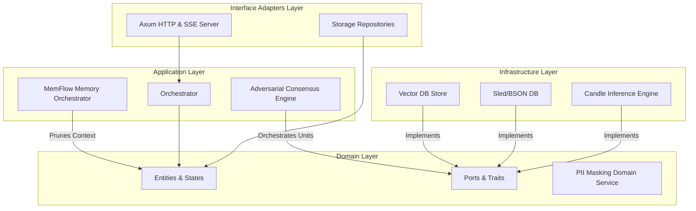

# MAGI (Multispectral Analysis & Global Integration) 소프트웨어 설계 명세서 (SDD)

## 1. 아키텍처 토폴로지 및 계층적 분리 (Clean Architecture)

본 시스템은 외부 프레임워크 및 데이터베이스 기술의 변동에 비즈니스 도메인의 논리적 무결성이 훼손되지 않도록 클린 아키텍처(Clean Architecture) 원칙을 엄격하게 구현합니다. 의존성의 흐름은 바깥쪽에서 안쪽(도메인 방향)으로만 흐르며, Interface Adapters 계층은 인프라 구조와 순수 도메인 개체 간의 번역기 역할을 완전히 담당하도록 고립화되어 있습니다.



### 1.1. 도메인 계층 (`magi_core/src/domain/`)
- 외부 라이브러리 및 런타임에 종속되지 않는 순수 비즈니스 엔티티([entities.rs](file:///e:/llmassist/upload/magi_core/src/domain/entities.rs))와 외부 세계와의 상호작용 규격을 정의하는 트레이트([ports.rs](file:///e:/llmassist/upload/magi_core/src/domain/ports.rs))를 포함합니다.
- 개인정보 보호를 위한 핵심 비즈니스 로직인 PII 마스킹 도메인 서비스([pii.rs](file:///e:/llmassist/upload/magi_core/src/domain/services/pii.rs))가 여기에 위치하여, 입력 및 출력 데이터가 시스템 경계를 넘기 직전에 무조건적인 마스킹 검증을 강제합니다.

### 1.2. 애플리케이션 계층 (`magi_core/src/application/`)
- 시스템 유스케이스를 오케스트레이션하는 중추입니다. 사용자 쿼리의 성격을 규명하고 처리 흐름을 중재하는 `Orchestrator`([orchestrator.rs](file:///e:/llmassist/upload/magi_core/src/application/orchestrator.rs))와 에이전트 간 비평 루프를 주관하는 합의 엔진이 존재합니다.
- 의도 기반 메모리 스트림 흐름을 통제하여 물리적 컨텍스트 윈도우 한계를 극복하는 `MemFlow`([memflow.rs](file:///e:/llmassist/upload/magi_core/src/application/memflow.rs))가 이 계층에서 상주하며 맥락 최적화를 동적으로 단행합니다.

### 1.3. 인터페이스 어댑터 계층 (`magi_core/src/adapters/`)
- HTTP REST 요청 수신, SSE(Server-Sent Events) 프로토콜을 이용한 실시간 토큰 및 텔레메트리 스트리밍 데이터 변환([http.rs](file:///e:/llmassist/upload/magi_core/src/adapters/http.rs))을 관장합니다.

### 1.4. 인프라스트럭처 계층 (`magi_core/src/infrastructure/`)
- Rust 네이티브 텐서 연산 프레임워크인 `Candle` 기반 로컬 모델 추론 가속 엔진, Sled 키-밸류 임베디드 데이터베이스를 활용한 비관계형 문서 영속화 레이어가 실제 물리 환경과 통신하는 영역입니다.

---

## 2. 6-Agent Consensus Protocol (다층 비평 합의 구조)

로컬 소형 언어 모델(sLM)의 한계점인 인지적 편향과 논리적 비약을 상쇄하기 위해 본 아키텍처는 **Draft-Critique-Consensus**의 3단계 적대적 상호 비평 구조를 설계 및 실구현하였습니다.

```
       [사용자 질의] -> PII 마스킹 -> Intent 분석
                                       │
                                       ▼
  ┌────────────────────────────────────────────────────────────────────────┐
  │ 1단계: 초안 작성 (Drafting)                                            │
  │  - Melchior (기술 사양/아키텍처), Casper (DeepSeek-R1 논리 추론)       │
  └────────────────────────────────────┬───────────────────────────────────┘
                                       │ (초안 전달)
                                       ▼
  ┌────────────────────────────────────────────────────────────────────────┐
  │ 2단계: 다각적 비평 및 보완 (Critique & Review)                         │
  │  - Balthasar (윤리적 합당성/젠더 연구 관점)                             │
  │  - Artaban (핵심 맥락 압축 및 유출 리스크 검토)                        │
  │  - Gushnasaph (코드 최적화 및 보안 오딧)                               │
  │  - Kagba (수치 및 실증 분석 데이터 무결성 검증)                         │
  └────────────────────────────────────┬───────────────────────────────────┘
                                       │ (비평 결과 피드백 루프)
                                       ▼
  ┌────────────────────────────────────────────────────────────────────────┐
  │ 3단계: 최종 합의 및 단일화 (Consensus Integration)                      │
  │  - Orchestrator (종합 판단 및 최종 Authoritative Report 조율)           │
  └────────────────────────────────────┬───────────────────────────────────┘
                                       │
                                       ▼
                               [최종 출력 스트림]
```

### 2.1. 유닛별 전문 역할 정의 (Role Specification)
- **Melchior (Technical)**: 엔지니어링 실현 가능성 및 구조적 무결성 분석.
- **Balthasar (Ethics/Social)**: 젠더 평등성, 사회적 배제 가능성, 도덕적 타당성 비평.
- **Casper (Logic/Reasoning)**: DeepSeek-R1 증류 모델 기반의 연쇄적 사고(Chain of Thought)를 통한 논리 디버깅 및 명제 무결성 보증.
- **Artaban (Summary/Context)**: 정보의 가용 전송률 및 밀도를 최적화하는 정보 압축 비평.
- **Gushnasaph (Coding/Spec)**: Rust/Flutter 네이티브 구현 관점에서의 메모리 안전성 및 성능 최적화 코드 검증.
- **Kagba (Math/Analysis)**: 정량적 통계 데이터 및 수치 연산 결과의 수학적 정합성 검증.

---

## 3. MemFlow 메모리 오케스트레이션 및 컨텍스트 관리

로컬 하드웨어(특히 Ryzen 5800U 및 16GB RAM) 환경의 물리적 한계를 극복하기 위해 `MemFlow` 프레임워크가 동적으로 동작합니다.

### 3.1. 의미론적 맥락 가지치기 (Semantic Context Pruning)
- 들어오는 질의의 임베딩 벡터를 실시간 추출한 후 임시 `SessionVectorDb`에서 코사인 유사도가 가장 높은 상위 문서 청크(`Top-K`)만을 취사선택합니다.
- `pruning_rigor` 설정에 따라 임계값(Threshold)과 로드할 도큐먼트의 수를 강제 조정하여 무의미한 맥락 누적으로 인한 sLM의 주의력 분산 및 컨텍스트 오버플로를 미연에 차단합니다.
- 4000자를 초과하는 비대칭 입력 쿼리는 토큰 효율을 보전하기 위해 프론트 통과 즉시 정밀 트런케이션(Truncation)됩니다.

### 3.2. 예측형 모델 로딩 (Predictive Loading) 및 자원 제어
- `ResourceManager`는 LRU 캐시 교체 알고리즘을 변형 적용하여 실행 예정인 다음 유닛의 GGUF 파일을 사전 백그라운드 스레드에서 메모리에 예측적으로 로딩(Predictive Loading)합니다.
- 동시 활성 모델 제한(`max_active_models`)을 준수하여 VRAM 2GB의 물리적 한계 환경(MX450)에서 CUDA 아웃 오브 메모리(OOM)가 야기하는 시스템 프리징 현상을 차단하고 잔여 물리 메모리를 10GB 미만으로 관리합니다.

---

## 4. 데이터 영속화 규격 (Dual-Layer Storage)

시스템 데이터는 목적에 따라 고속 디스크 쓰기가 보장되는 듀얼 레이어 엔진에 이중 분산 기록됩니다.

### 4.1. 비관계형 구조 문서 저장소 (Sled/BSON)
- 대화 세션 기록, 로컬 설정 상태 메타데이터 등 트리형 데이터 구조 보전을 위해 Sled 기반 임베디드 KV 저장소를 도입하였습니다. BSON 직렬화를 통해 빠르고 유연한 스키마리스 저장을 지향합니다.

### 4.2. 의미론적 검색 벡터 데이터베이스 (Vector DB)
- 로컬 `vector_db/knowledge_base.json` 및 `vector_db/sessions/` 내의 개별 JSON 세션 파일을 메모리 맵 구조로 적재하여 RAG 연산에 필요한 고속 인덱싱 구조를 구현합니다.
- 사용자 피드백 가중치([feedback.jsonl](file:///e:/llmassist/upload/vector_db/feedback.jsonl))가 기록될 때마다 관련성 랭커(Ranker)가 벡터 검색 거리를 보정하여 점진적이고 자율적인 추론 최적화를 달성합니다.
